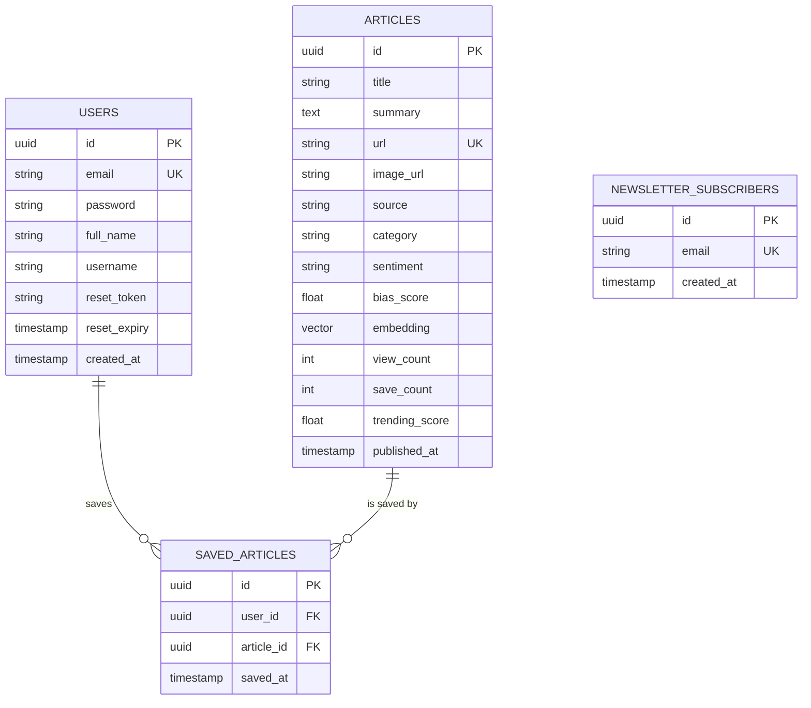

# 🗄️ NewsAI Database Architecture

This document outlines the PostgreSQL database schema used by the NewsAI Intelligence Platform. The database is hosted on **Supabase** and uses **pgvector** for semantic search capabilities.

## 📊 Entity Relationship Diagram (ERD)



---

## 📑 Table Definitions

### 1. `users`
Stores user identity and authentication data.
- `id`: Primary Key (UUID).
- `email`: Unique login identifier.
- `reset_token`: Hashed token for password recovery.
- `reset_expiry`: Expiration time for the reset token (1 hour).

### 2. `articles`
The core of the platform. Stores analyzed news data.
- `embedding`: A **1536-dimensional vector** for AI semantic search.
- `sentiment`: AI-analyzed tone (Positive/Negative/Neutral).
- `bias_score`: AI-calculated political/media bias (0.0 to 1.0).
- `trending_score`: Calculated via `(views * 1) + (saves * 5)`.

### 3. `saved_articles`
Join table connecting users to their bookmarked news.

### 4. `newsletter_subscribers`
Managed list for automated email digests via Brevo.

---

## 🛠️ Setup SQL Script

To recreate this database environment, run the following SQL in your PostgreSQL terminal or Supabase SQL Editor:

```sql
-- Enable Vector Extension
CREATE EXTENSION IF NOT EXISTS vector;

-- Users Table
CREATE TABLE users (
    id UUID PRIMARY KEY DEFAULT gen_random_uuid(),
    email TEXT UNIQUE NOT NULL,
    password TEXT NOT NULL,
    full_name TEXT,
    username TEXT,
    reset_token TEXT,
    reset_expiry TIMESTAMP,
    created_at TIMESTAMP DEFAULT NOW()
);

-- Articles Table
CREATE TABLE articles (
    id UUID PRIMARY KEY DEFAULT gen_random_uuid(),
    title TEXT NOT NULL,
    description TEXT,
    content TEXT,
    url TEXT UNIQUE NOT NULL,
    image_url TEXT,
    source TEXT,
    category TEXT,
    published_at TIMESTAMP,
    sentiment TEXT,
    bias_score FLOAT,
    summary TEXT,
    embedding vector(1536),
    view_count INT DEFAULT 0,
    save_count INT DEFAULT 0,
    trending_score FLOAT DEFAULT 0,
    created_at TIMESTAMP DEFAULT NOW()
);

-- Saved Articles Table
CREATE TABLE saved_articles (
    id UUID PRIMARY KEY DEFAULT gen_random_uuid(),
    user_id UUID REFERENCES users(id) ON DELETE CASCADE,
    article_id UUID REFERENCES articles(id) ON DELETE CASCADE,
    saved_at TIMESTAMP DEFAULT NOW(),
    UNIQUE(user_id, article_id)
);

-- Newsletter Table
CREATE TABLE newsletter_subscribers (
    id UUID PRIMARY KEY DEFAULT gen_random_uuid(),
    email TEXT UNIQUE NOT NULL,
    created_at TIMESTAMP DEFAULT NOW()
);
```
